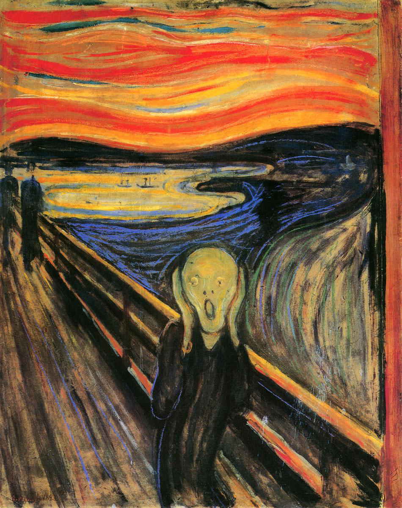
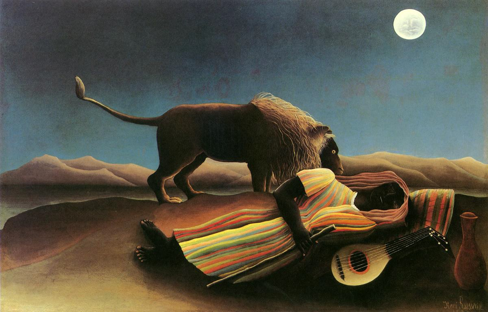
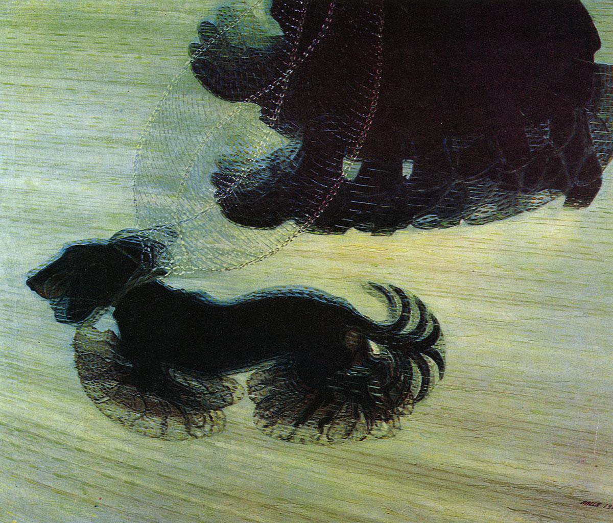
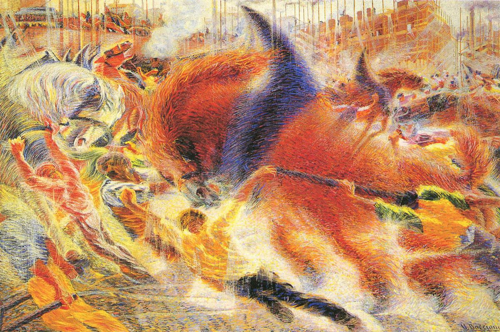
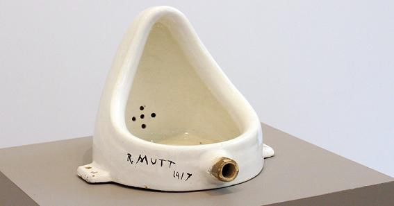

# 其他西方现代艺术

## 表现主义艺术：灵魂深处的呐喊

表现主义（Expressionism），现代重要艺术流派之一。20世纪初流行于德国、法国、奥地利、北欧和俄罗斯的文学艺术流派。

资本主义的物欲横流导致了人类精神世界的空虚，道德的沦丧、心灵的异化、精神的压抑、人性的疏离、贪婪和罪恶等等无不刺痛良知者的内心。表现主义艺术在思想内容上反映了知识分子对所谓的“现代西方资本主义文明”深切的危机意识和紧迫的变革意识。

表现主义成员大都受康德哲学、柏格森的直觉主义和弗洛伊德精神分析学的影响，强调反传统，不满于社会现状，要求改革，要求“革命”。

表现主义多采取粗放、扭曲的笔触，主观个性的色彩，夸张变形的手法，传达艺术家内在情感的冲动和激情。

表现主义重个性，重情感色彩，主张表现“精神的美”。

表现主义艺术还强调关注社会变革，参与社会变革，探索当下社会和人生的重大问题。

### 爱德华·蒙克

爱德华·蒙克（EdvardMunch，1863—1944）：挪威艺术家，20世纪最杰出的现代艺术大师之一，表现主义艺术的国际先驱者和领袖。

呐喊

## 稚拙主义艺术

20世纪产生于法国的画派，又称稚拙派。此派画家受柏格森“直觉论”的影响在创作中极力主张返回原始艺术的风格中去，追求原始艺术的那种自然天成的表现形式，努力表达直接的朴素的印象。

表现人的纯真无邪和朴素无华的本质。

### 卢梭

亨利·朱利安·费利克斯·卢梭（Henri Julien Félix Rousseau,1844－1910），法国卓有成就的伟大画家，稚拙主义艺术的代表。

沉睡的吉普赛少女

## 未来主义艺术

未来主义艺术（Futurism）是二十世纪初期在意大利兴起的一场广泛的文艺运动。

未来主义成员受到尼采、柏格森哲学思想的影响。以同旧的传统的文化相决裂、追求文学艺术内容和形式的革新为旗帜。

未来主义是对西方现代工业文明、科学技术的歌颂和赞美。

### 巴拉

贾科莫·巴拉(Giacomo Balla, 1871–1958) 意大利画家，未来派最杰出的人物。

拴着皮带的狗

### 波丘尼

翁贝托·波丘尼(Umberto Boccioni,1882-1916)，意大利未来派画家和雕塑家。曾师从巴拉。1907年定居米兰，在诗人马里内蒂影响下，刻意表现现代生活的暴力与快节奏，试图把运动、光和声转化成形体。

城市的兴起

## 达达主义

达达主义艺术是在第一次世界大战期间，诞生于瑞士，影响遍及整个欧洲的二十世纪西方现代艺术的重要流派。

达达主义艺术是一种综合的文化艺术现象，其宗旨是批判、否定一切传统的道德观念和美学体系，否定理性和传统文化。

达达主义艺术提倡无目的、无思想、不受任何规则束缚的文艺。带有浓厚的虚无主义情结。

战争的炮火彻底毁灭了艺术家内心的唯美主义情结，导致了虚无主义和批判性艺术的出现。达达主义艺术正是诞生于战争的疯狂、痛苦和混乱之中的艺术样式。

### 杜尚

马塞尔·杜尚（Marcel Duchamp，1887—1968）法国艺术家，二十世纪实验艺术的先锋，达达主义艺术中的典型人物和精神领袖。他的出现改变了西方现代艺术的进程，被誉为“西方后现代艺术之父”。

杜尚的“现成品”艺术开创了后期现代艺术中波普艺术、装置艺术、环境艺术和行为艺术的先河。

杜尚艺术的核心是颠覆传统的艺术观，消融艺术与非艺术的界限。让一切成为艺术，艺术成为一切，打破生活与艺术的界限。

泉

