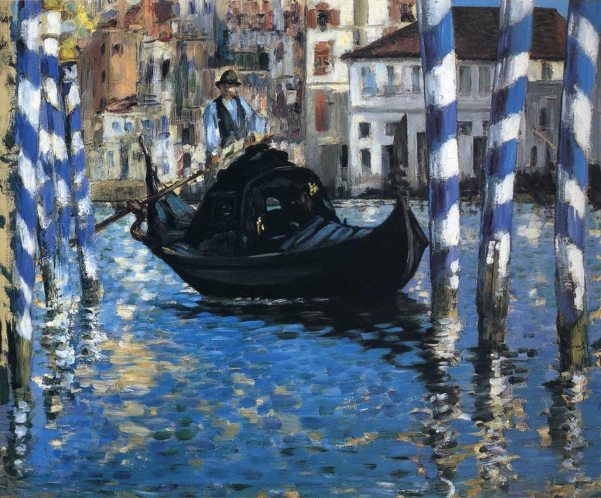

# 印象主义艺术 

印象主义是西方绘画史中的重要艺术流派，产生于19世纪六十年代的法国, 19世纪七八十年代达到了它的鼎盛时期，其影响遍及欧洲，并逐渐传播到世界各地。

印象派的名字起源于1874年法国画家莫奈创作的《印象·日出》

印象派在绘画中注重对外光的研究和表现，主张到户外去，在阳光下依据眼睛的观察和现场的直感作画，表现物象在光的照射下，色彩的微妙变化。

印象主义绘画以表达瞬间的视觉印象为目标

印象主义代表画家

- 马奈（1832-1883）：印象派的奠基人
- 莫奈（1840-1926）：印象派之父
- 德加（1834-1917）：古典的印象主义
- 雷诺阿（1841-1926）: 欢乐的歌者

## 马奈

艺术特点：秉承写实主义的创作原则，强调视觉感受的直接表达，色彩响亮、笔触简洁，艺术作品将古典的高贵气质与华丽的印象派色彩巧妙融合。

代表作：

草地上的午餐

奥林匹亚

威尼斯大运河

福利斯·贝热尔的吧台

## 莫奈

艺术特点：擅长描绘大自然中光与色的变化，笔法自由，色彩强烈，富有写意性，艺术作品强调转瞬即逝的感觉。

## 德加

艺术特点：构图奇特，喜欢表现处于活动状态中的人物形象，尤其擅长表现芭蕾舞演员。

## 雷诺阿

艺术特点：以描绘大自然中的女性和儿童为主，色彩丰富华丽，作品犹如阳光下开满花朵的田野，令人赏心悦目。

