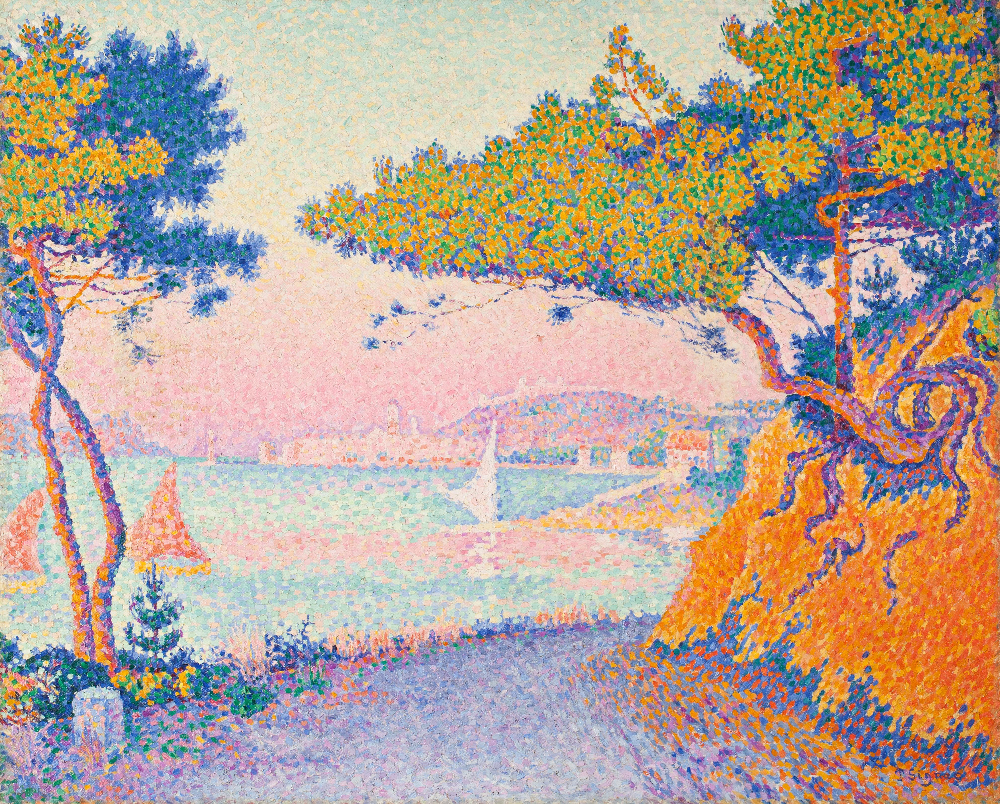

# 新印象主义艺术

新印象主义(New-Impressionism) 是十九世纪八十年代，继印象派之后诞生于法国的现代美术流派。

自然科学试验的成果表明：在光的照耀下一切物象的色彩都是可分割的，运用这种方法把不同的纯色点不经调混地并列在一起，颜色的亮度可以获得最鲜明的效果，而中间色则是在观赏者眼中的视觉调绘中形成的。

新印象主义根据这一色彩分割的理论作画, 所以也被称作“分割主义”(Divisionism)。因为他们在具体敷色时运用点彩的表现方法, 所以又被称作"点彩派"(Pointillism)。

- 印象主义画家强调色彩的光学混合作用，不反对色彩混合使用。
- 新印象主义则强调不在调色板上调和各种颜色，把各种单纯的单色通过细小的笔触并列在画面上，经过观者的视觉作用达到自然调和，给人以冷漠和静止的感觉。

- 印象主义所表现的是主观化了的客观事物
- 新印象主义就是表现纯客观的对象

## 风格特点

- 形式技法：新印象主义废除了在调色板上调色的传统方法。依据科学的色彩原理，将精确的原色点配置在画布上，以光学的调和代替了传统绘画中颜料的调和。
- 题材选择：新印象派多以表现大自然的风景为主。画面色彩效果更加强烈鲜明，并有一种令人陶醉的朦胧美和装饰性意味。
- 美学特质：新印象主义是具有科学的理性精神和逻辑意识的艺术流派。

## 代表人物

乔治·修拉、保罗·西涅克、卡米尔·毕沙罗、M. 吕斯、H.E.克罗斯

## 修拉

修拉（Georges Seurat，1859—1891），法国画家，新印象主义画派（点彩派）的创始人。

大碗岛的星期日下午

摆姿势的模特

## 保罗·西涅克

保罗·西涅克(Paul Signac, 1863-1935)，法国新印象派创始人之一，他主要画风景，且经常使用点彩派技法作画。作品富于激情，善用红色作为基调，色彩鲜明。

卡努比埃的松树

