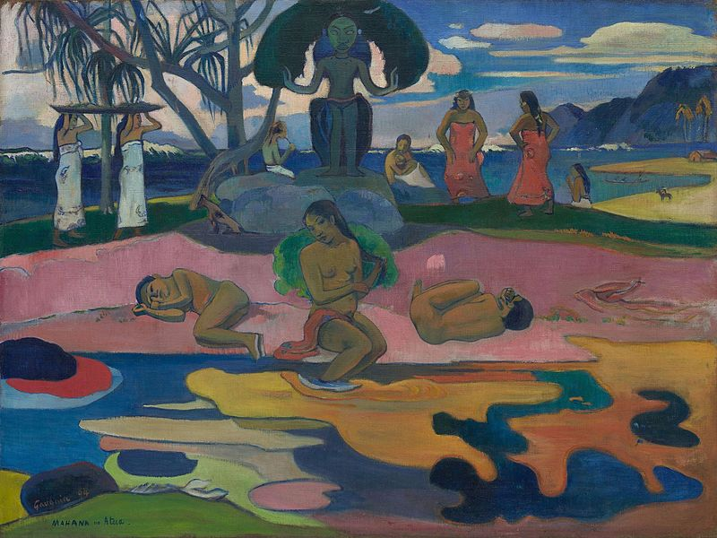
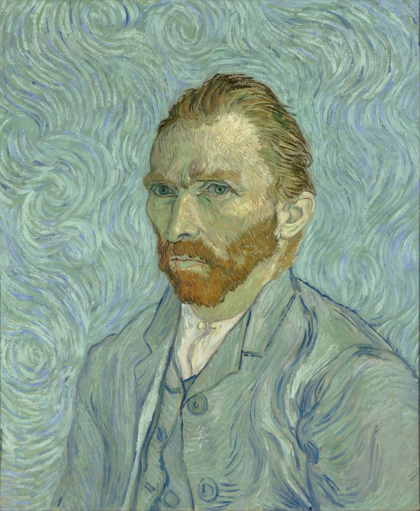

# 后印象主义艺术

后印象派（Post-Impressionism），后印象主义艺术泛指印象主义之后，在艺术观念和艺术实践上都与印象主义**大相径庭**的艺术思潮。

“后印象”的名称是由英国批评家罗杰·弗莱(Roger Fry)提出的，在他看来，后印象主义可以归结为一种“表现性”的艺术。

在十九世纪末，许多曾受到印象主义鼓舞的艺术家开始反对印象派，他们不满足于刻板片面的追求光色，强调作品要抒发艺术家的**自我感受和主观感情**。

## 风格特点

主张艺术应揭示主观世界，强调艺术作品要着重体现艺术家内在的主观理念、情感特征和精神意蕴。

西方传统艺术与现代艺术之间转换的历史性桥梁。

## 塞尚

保罗·塞尚（Paul Cezanne，1839—1906）是后印象主义艺术的代表画家。

善于表现静物和风景，排除外光的干扰，追求永恒性的形体和坚实的结构。

立体派和抽象派的始祖。 多点透视

带瓷罐的水果静物

圣维克图瓦山

玩纸牌的人

## 高更

保罗·高更（Paul Gauguin，1848—1903）是后印象主义艺术的代表画家。

主张艺术回归原始，绘画中流露出原始的抽象性和概括性。

艺术理念直接影响了20世纪西方现代艺术诸流派，如野兽派艺术、原始主义艺术、风格主义艺术等。

布道后的幻觉

捧红果的少女

敬神日

我们从哪里来?我们是谁?我们往哪里去? 

## 梵高

温森特·梵高（Vincent Van Gogh，1853—1890）是后印象主义艺术的重要画家。

艺术作品具有最独特的个性和非凡的魅力。

艺术风格对20世纪西方现代艺术中的表现主义艺术、象征主义艺术产生重要影响。

自画像

星月夜

麦田群鸦

