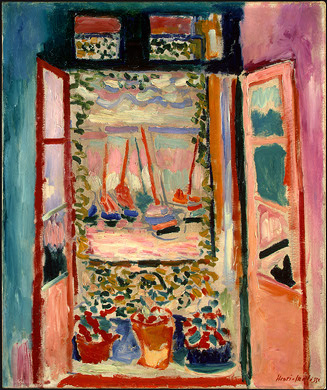
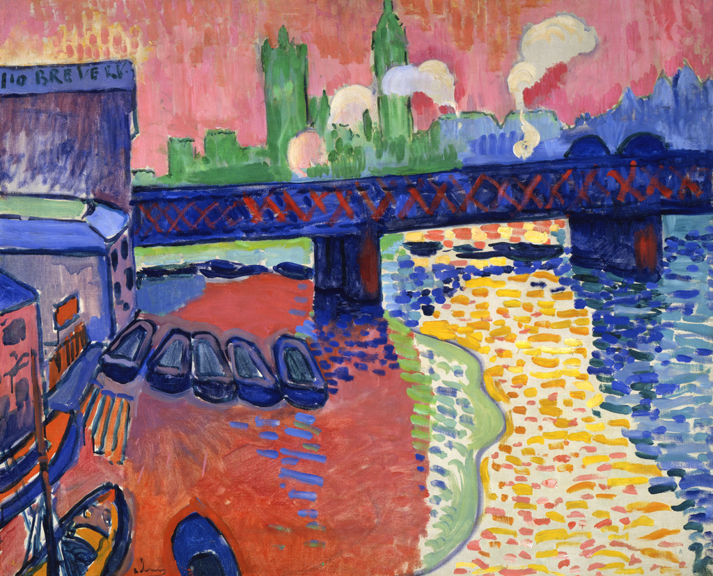
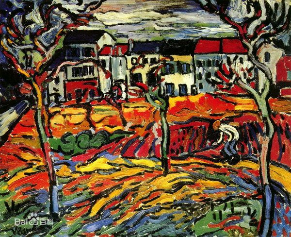
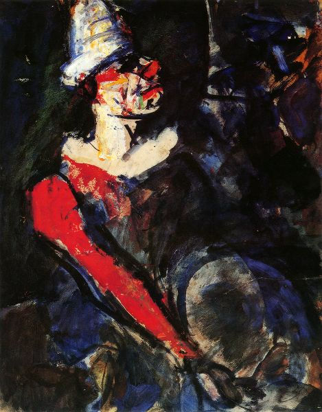

# 野兽派艺术

野兽主义(Fauvism)是自1898至1908年在法国盛行的现代绘画潮流。野兽派画家热衷于运用鲜艳、浓重的色彩，往往用直接从颜料管中挤出的颜料，以直率、粗放的笔法，创造强烈的画面效果，充分显示出追求情感表达的表现主义倾向。

野兽主义艺术摆脱了物体固有的色彩特征，运用简练的线条和夸张的颜色来实现色彩在画面中的完全释放和独立。

野兽派画风不再特别讲究透视和明暗、放弃传统的透视与明暗关系，采用更加平面化的构图、野兽派艺术最大的魅力在于色彩上的独立性，它不再依附于客观物象的束缚，而成为艺术家主观感受的外在表现形式。

## 亨利·马蒂斯

亨利·马蒂斯（Henri Matisse，1869—1954），法国著名画家，野兽派的创始人和主要代表人物，也是一位雕塑家、版画家。他以使用鲜明、大胆的色彩而著名。

戴帽子的女人像

窗外

## 德兰

德兰(Andre DERAIN，1880—1954)是开创了20世纪初期革新性绘画的先驱者之一。他运用强烈的色彩大胆描绘出简洁化的绘画，与亨利·马蒂斯一同被称作“野兽派”。

威斯敏斯特桥

## 弗拉芒克

莫利斯·德·弗拉芒克（Maurice de Vlaminck，1876-1958），他喜欢用锡管里直接挤出来的明亮的色彩，把鲜红色与纯橘色结合起来，并以鲜明的蓝色和绿色来使色彩更为强烈，他的画和凡·高一样在燃烧。

夏都的住宅

## 鲁奥

乔治·鲁奥（Georges Rouault，1871–1958年），法国画家和雕塑家。他在作品中用强烈的色彩和扭曲的线条描绘人类的痛苦。风格接近表现主义，关心的并不是画面的处理，而是心灵寄托，宗教气氛极浓。

小丑

