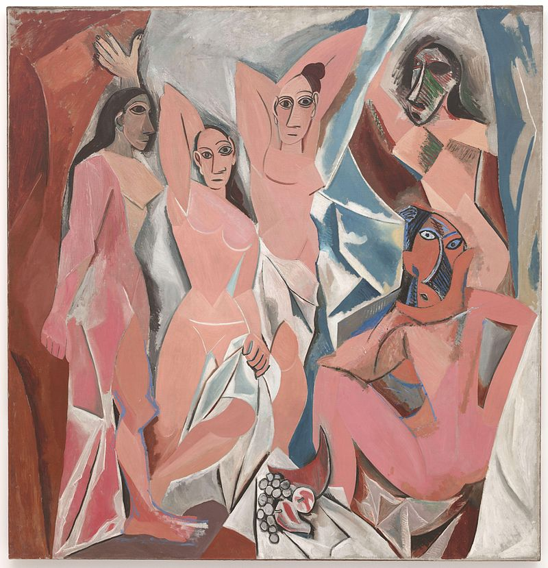
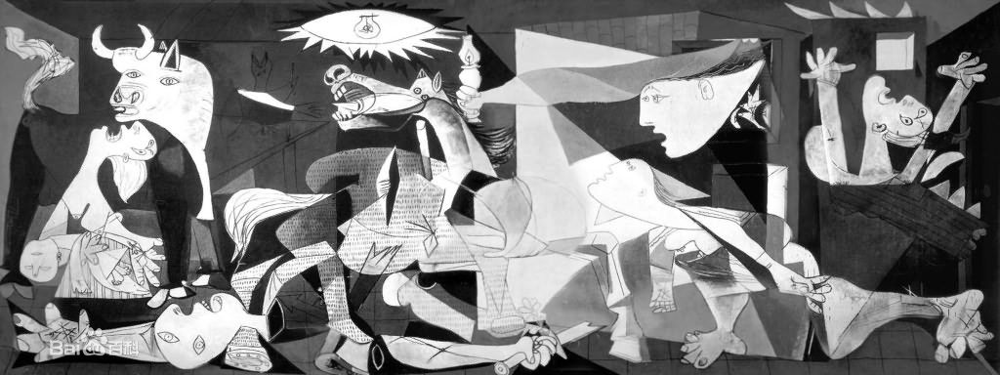

# 立体主义艺术

立体主义(Cubism)是西方现代艺术史上的一个运动和流派，又译为立方主义，1908年始于法国。

立体主义的艺术家追求碎裂、解析、重新组合的形式，形成分离的画面。

艺术家以许多的角度来描写物象，将其置于同一个画面之中，以此来表达对象物最为完整的形象。

## 毕加索

巴勃罗·毕加索（Pablo Picasso，1881-1973），西班牙画家、雕塑家。法国共产党党员。是现代艺术的创始人，西方现代派绘画的主要代表。

蓝色时期-粉红色时期-风格多样化时期

亚威农少女

格尔尼卡

## 其他代表作家

莱热，格里斯，德劳内