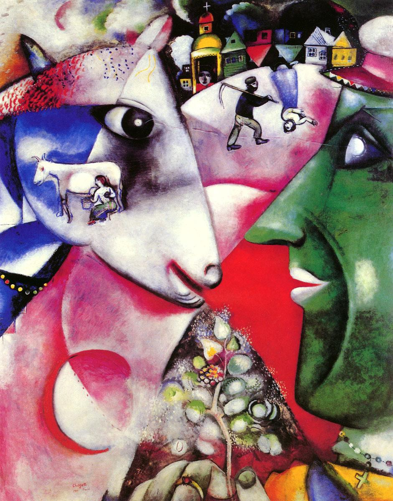
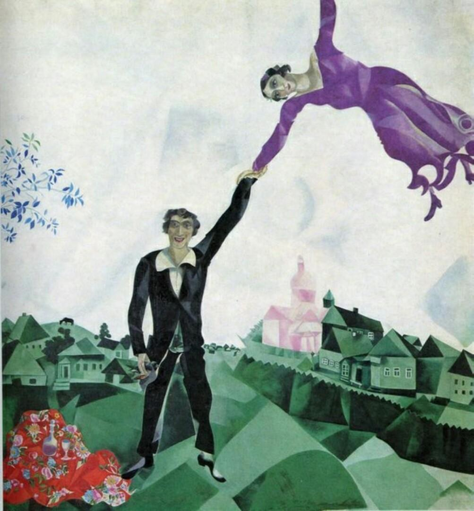
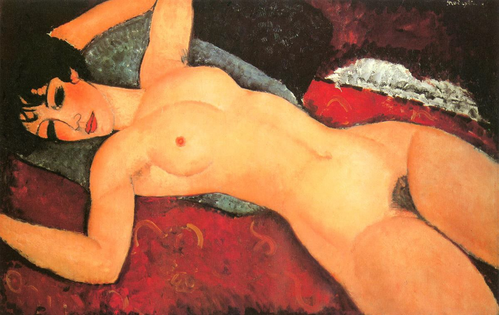
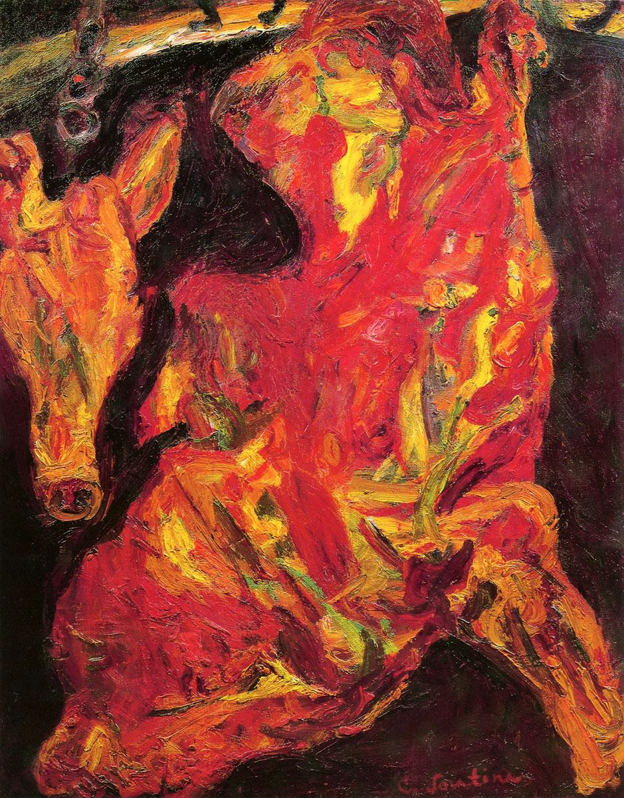

# 巴黎画派

巴黎画派是指二十世纪初期、聚集在法国巴黎的一个外国艺术家团体。他们保持已有的艺术特点和个人风格，注重意境创造和抒情性，表现自己在贫困、忧愁、思乡等遭遇中的各种感受。他们没有结成社团，风格也各不相同，人们统称其为“巴黎画派”。

巴黎画派的成员大都是犹太人，是流落异乡的犹太人后裔。这群艺术家年龄相仿，属于同一代人。他们在巴黎都曾经处于贫穷的状态，生活的艰辛、孤独与凄凉使他们越走越近。

巴黎画派的艺术家都深受野兽派、立体派和表现主义等艺术思潮的影响。艺术多采取抒情主义和象征主义的表现方法，抒发内心深处强烈且绵长的忧伤之情。

第二次世界大战之后，西方艺术中心由法国巴黎转向美国纽约，“巴黎画派”成为一个与“纽约画派”相对应的地域性艺术。

## 马克·夏加尔

马克·夏加尔（Marc Chagall，1887—1985）巴黎画派的掌门人。

夏加尔的艺术充满了浓厚的抒情性和犹太民族特有的精神意蕴：孤独与乡愁。他的画中呈现出梦幻、象征性的手法与色彩。

艺术特点：漂浮

我与乡村

散步

## 莫迪利亚尼

阿米蒂奥·莫迪利亚尼（AmedeoModigliani，1884—1920）是一个才华横溢的波西米亚艺术家。

莫迪利亚尼的肖像作品有着统一的造型模式：修长的脸形、杏仁般的眼睛、柔软且被拉长了的躯体。纤细雅致的线条和浓郁的色彩传达出艺术家内心深处难以言表的忧伤之情。

侧卧的裸女

## 柴姆·苏丁

柴姆·苏丁(ChaimSoutine，1894—1943)是巴黎画派重要的画家。

他艺术中肆意奔放的笔触比二十世纪初的任何一位艺术家都更靠近抽象表现主义艺术。

半片牛肉

