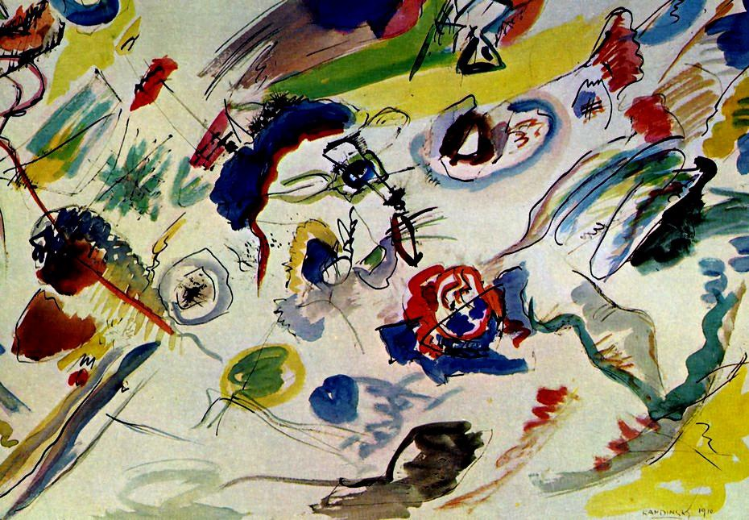
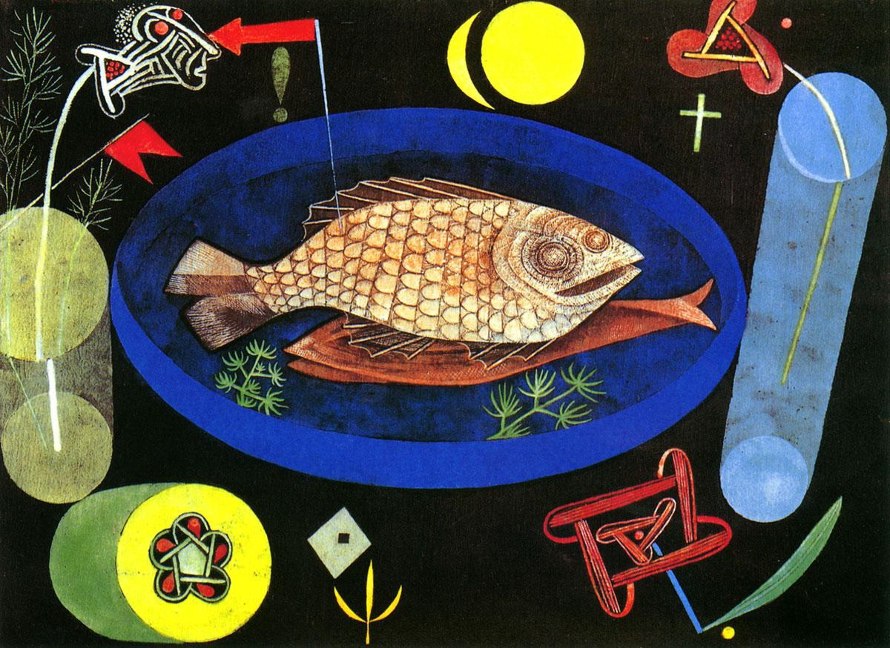
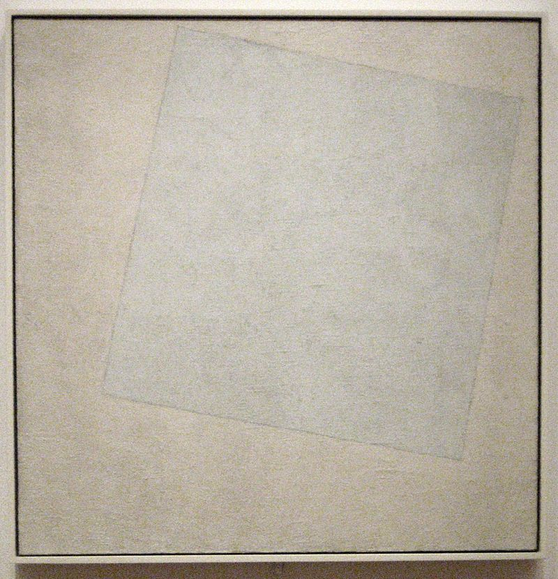

# 抽象主义艺术

抽象主义艺术：是指20世纪初，出现在欧洲的一个反对表现视觉印象和视觉经验的艺术流派，是泛指脱离“模仿自然”的绘画风格的“非具象艺术”。

- 野兽派艺术：提供了色彩抽象因素

- 立体派艺术：提供了造型抽象因素

- 表现主义艺术：提供了精神抽象因素

抽象是宇宙的空间概念，永恒是宇宙的时间概念。抽象与永恒，共同构成宇宙时空的本质。

抽象艺术是通过抽象的点、线、面、色彩等绘画元素的构成来表达和叙述人性的艺术方式。

- 点是画面中活跃的中心

- 线是过程，可以表示情绪的变化

- 面具有很强的包容性

- 色彩色彩是抽象艺术表现中最重要的手段之一。

抽象注意艺术可以分为热抽象和冷抽象。

1. 热抽象主义艺术：又称抒情抽象主义艺术，主观抽象主义艺术。艺术作品注重表达艺术家强烈的、独特的情感体验。

2. 冷抽象主义艺术：几何的抽象，客观的抽象。理性的、构成的、几何学的、建筑形态的。

	- 垂直与水平结构成为画面的主导地位。

	- 艺术中强调几何块面的表现力和色彩的单纯性。

	- 艺术追求理性美，直角美。

	- 艺术具有静止、平衡的美感。

## 康定斯基

瓦西里·康定斯基(Wassily Kandinsky，1866—1944)是现代艺术的伟大人物之一，是现代抽象艺术在理论和实践上的奠基人。除了是抽象主义艺术的代表画家之外，还是德国表现主义的领军人物。

抽象绘画是通过心灵体验而创造的。

抽象艺术追求画面的“音乐化”。康定斯基把色彩赋以音色上的联系。比如：淡蓝色是长笛，深蓝色是管风琴；绿色像小提琴舒缓的音色；红色好似雷鸣般的鼓声

主张艺术中的即兴的、无目的和无意识性的创作方法。

## 保罗·克利

保罗·克利(Paul Klee，1879-1940），最富诗意的造型大师。

艺术创作是一种直觉行动。由艺术家的独特精神而引发，受艺术家各种体验的影响。

艺术目的不在于表现，而在于创造。

艺术并不描绘可见的东西，而是把不可见的东西创造出来

克利的艺术既浪漫有神秘：画家将自己内在幻想同外部世界体验结合起来。

风格特点：鱼以及抽象符号

鱼的循环

## 蒙德里安

彼埃·蒙德里安（Piet Cornelies Mondrian，1872-1944），荷兰画家，风格派运动幕后艺术家和非具象绘画的创始者之一，对后世的建筑、设计等影响很大。平衡与战争

艺术基本框架：垂直线、水平线、矩形、红黄蓝三原色、黑白灰的背景。

绘画的本质思想：纯洁性、规律性、最抽象、最简化。

## 马列维奇

卡西米尔·塞文洛维奇·马列维奇（Kasimier Severinovich Malevich，1878—1935）是康定斯基同时代的艺术大师，抽象主义绘画的另一位奠基人。

俄国十月革命前，马列维奇还参与过立体主义和未来主义的艺术运动。1915年他在俄国创立了几何抽象社团“至上主义”画派。

“至上主义”亦称“绝对主义”。是最早出现的纯几何抽象绘画。

“有创造性的艺术，纯感觉至上”，“纯粹感觉的至尊表现”。

