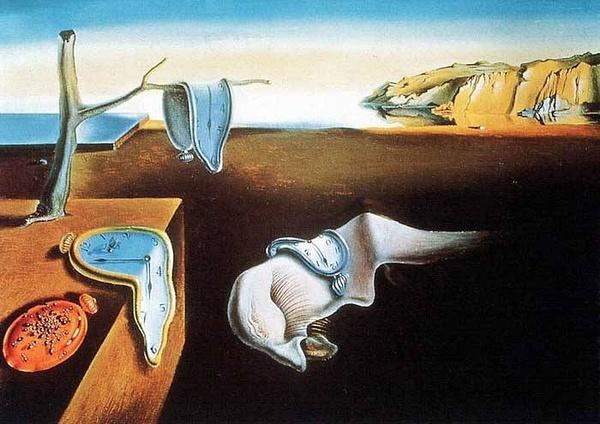

# 超现实主义艺术

超现实主义艺术（Surrealism）：**产生于两次世界大战之间**，在法国兴起的一个国际性的文学、艺术运动。它在文学、艺术、戏剧、音乐等各个领域都有所表现，其影响遍及整个欧洲。

布雷东（Breton 1896——1966）：法国著名诗人，超现实主义艺术运动的发起人。被誉为“超现实主义教父”。

黑格尔的辩证法和亨利·柏格森的“生命冲动”学说是超现实主义产生的哲学基础。

奥地利著名精神病学家、心理学家弗洛伊德的潜意识理论是超现实主义艺术的精神动力。

超现实主义艺术创造的是不符合逻辑和现实存在的视觉图式，是艺术家先天的精神本能、潜意识的感情流露和自我阐释。

超现实主义艺术作品充满荒诞、离奇、魔幻、神奇的特色。

超现实主义艺术的核心是神秘的幻想主义，是人类想象的极端化表现和心灵世界的再创造。

超现实主义艺术是西方现代艺术的终结，西方后现代艺术的开始。

艺术类别：

- 逼真超现实主义艺术（魔幻超现实主义艺术、自然主义的超现实主义艺术）

	代表艺术家：达利，马格利特
	
	艺术风格：逼真的写实手法，展示错位、变形、幻想、富有魔力、荒诞的梦境世界。
	
- 象征超现实主义艺术（生物生态超现实主义艺术、有机超现实主义艺术）

	代表艺术家：米罗
	
	艺术风格：抽象的形式展现一种优美的、无意识幻想的画面，具有抽象化的装饰风格。

## 达利

萨尔瓦多·达利（SalvadoDali 1904——1989）西班牙现代艺术大师，超现实主义艺术领袖，被誉为“20世纪艺术界怪才”。

萨尔瓦多·达利艺术追求极度的无理性，热衷于描绘自己的幻想、梦境、记忆或潜意识，并通过逼真的绘画技法造成一个荒谬绝伦而又十分酷似客观世界的幻觉世界。使人过目难忘，印象极深。

记忆的永恒

天鹅的倒影

## 马格利特

雷恩·马格利特（Rene Magritte，1898—1967）逼真超现实主义的另外一位代表画家。

马格利特的艺术常常通过这些孤立、混淆、渗透、变更、并存在一起的方法彻底地搅乱了我们的思维和感官，从而实现了超现实主义的最高理想。

形象的背叛

## 胡安·米罗

胡安·米罗（Joan Miro，1893—1983）西班牙著名画家，超现实主义的伟大天才之一，二十世纪最知名的全才型艺术大师。

他的超现实主义艺术独创了一系列潜意识的象征符号，成为“有机超现实主义”的杰出代表。

小丑的狂欢节

